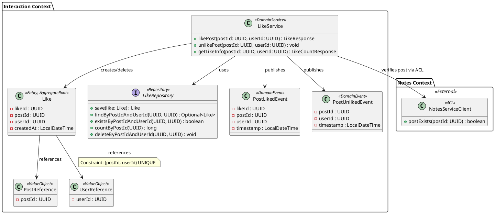

# Interaction Bounded Context

**Owner:** Nur Alislam Kastiro (22331549)

## Overview

The Interaction Context handles likes on notes/posts within StudyHub. It covers recording a like, preventing duplicates, publishing events so other services (like Notifications) can react, and returning like counts to the frontend.

It only deals with likes — it doesn't own post or user data. It references them by ID only. Post content lives in the Notes context, user profiles in the User/Auth context.

---

## DDD Building Blocks

### Aggregate

**LikeAggregate** — root entity is `Like`

Each like is its own aggregate. The main invariant is:

> A user cannot like the same post more than once.

This is enforced both at the domain service level (existence check before creation) and at the database level via a unique constraint on `(post_id, user_id)`.

---

### Entities

**Like**
```
Like {
    likeId     : UUID          [identity]
    postId     : UUID          [PostReference - foreign key only]
    userId     : UUID          [UserReference - foreign key only]
    createdAt  : DateTime
}

Constraint: (postId, userId) UNIQUE
```

---

### Value Objects

**PostReference**
```
PostReference {
    postId : UUID
}
```
A reference to a post in the Notes context. The Interaction context does not hold post data — it only stores the ID. When it needs to verify a post exists, it calls the Notes service through an ACL.

**UserReference**
```
UserReference {
    userId : UUID
}
```
Extracted from the JWT token on each request. The Interaction context trusts the auth token and does not call the User/Auth service on every like operation.

---

### Repository

**LikeRepository**
```
LikeRepository {
    save(like: Like) : Like
    findByPostIdAndUserId(postId: UUID, userId: UUID) : Optional<Like>
    existsByPostIdAndUserId(postId: UUID, userId: UUID) : boolean
    countByPostId(postId: UUID) : long
    deleteByPostIdAndUserId(postId: UUID, userId: UUID) : void
}
```

---

### Domain Service

**LikeService**

Handles the business logic that cannot sit on the entity alone:

- `likePost(postId, userId)` — checks duplicate, verifies post exists via ACL, persists Like, publishes PostLikedEvent
- `unlikePost(postId, userId)` — checks like exists, deletes it, publishes PostUnlikedEvent
- `getLikeCount(postId, userId)` — returns count and whether current user has liked

---

### Domain Events

**PostLikedEvent**
```
PostLikedEvent {
    likeId    : UUID
    postId    : UUID
    userId    : UUID       (who liked)
    timestamp : DateTime
}
```
Published to RabbitMQ when a like is created. Consumed by the Notification service to alert the post author.

**PostUnlikedEvent**
```
PostUnlikedEvent {
    postId    : UUID
    userId    : UUID
    timestamp : DateTime
}
```
Published when a like is removed.

---

## Inter-Context Contracts

### Upstream Dependency: Notes Context (ACL)

Before recording a like, the Interaction service verifies the post exists by calling the Notes service. To avoid coupling, the response is mapped into a local `PostReference` value object — the Interaction context does not import or depend on the Notes service's domain model.

```
GET /api/posts/{postId}  →  Notes Service (port 8082)
Response mapped to: PostReference { postId }
Circuit breaker applied: if Notes service is down, fallback returns 503
```

### Downstream: Notification Context (Event)

The Interaction service publishes `PostLikedEvent` to RabbitMQ.
- Exchange: `studyhub.events`
- Routing key: `interaction.post.liked`
- The Notification service subscribes and sends a notification to the post author.

### API exposed to API Gateway

```
POST   /api/posts/{postId}/like    →  like a post
DELETE /api/posts/{postId}/like    →  unlike a post
GET    /api/posts/{postId}/likes   →  get like count + likedByCurrentUser flag
```

---

## UML Class Diagram (PlantUML)


